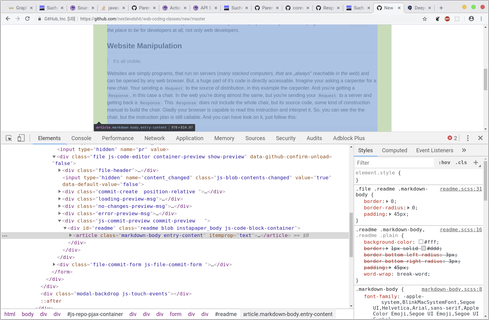

# WCC Session 1

Welcome to the first Web Coding Class Session. 
If you're a total beginner and want to start coding, you'll find here much introductional information on how the Internet works, what happens in the background of your browser while you're browsing the web etc.
There is a huge demand on good web developers.
What basically is meant by „good” we will explain on a later session.
But, don't worry and go ahead or even skip different sections or even whole session.

## Creating Accounts

> Web developers are not alone.

After a while you will see how huge our community is.
We're having our own „newspapers“, question-and-answer (Q&A) platforms and space to colaborate, present and discuss your own projects.
And you're already right there.
This is `GitHub`.
It's *the place to be* for developers at all, not only web developers.

## Website Manipulation

> It's all visible.

Websites are simply programs, that run on servers (*many stacked computers, that are „always“ reachable in the web*) and can be opened by any web browser.
If you buy any program out their, except it's open source, you won't be able to looks what's going up inside.
It's like buying a smartphone or laptop without any simple possibility to change the battery.
But websites are differnt, because a huge part of it's code is directly accessable.
So, you can have a close look on what's going up in there.
Imagine you're asking a carpenter for a new chair.
Your sending a `Request` to the source of distribution, in this example the carpenter.
And you're getting a `Response`, in this case a chair.
In the web you're doing almost the same, but you're sending your `Request` to a server and getting back a `Response`.
This `Response` does not include the whole chair, but its source code, some kind of construction manual to build the chair.
Gladly your browser is capable to read this instruction and interpret it.
So, you can see the the chair, but the instruction plan is still callable.
And you can have look on it, just follow this:

```
1. Right-click any content in this web page.
2. Choose „Inspect“
```

You could also hit the `F12` key on your keyboard.
This opens the `Inspector` which lets you dive into a huge part of the code.


<center>
  <small><i>Chromium Browser with opened Inspector Tool</i></small>
</center>
